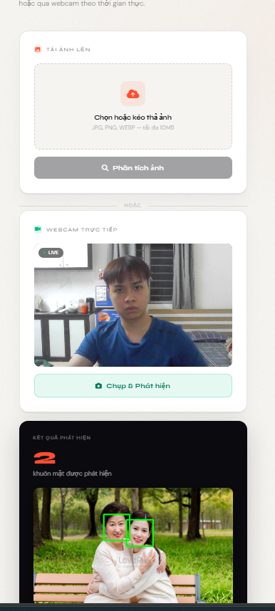

# AI Face Detection Web

A web application for detecting faces from uploaded images and webcam frames.

## Demo



## Technologies

- Laravel (web backend)
- Python Flask (AI API)
- OpenCV (face detection)
- MySQL / SQLite (database)
- JavaScript (webcam capture)

## Features

- Upload image and detect faces
- Webcam real-time face detection
- Save detection history
- Dashboard statistics

## System Architecture

Browser -> Laravel Web App -> Flask AI API -> OpenCV

## Setup

### 1) Clone project

```bash
git clone https://github.com/leduc-vn/lemanhducproject.git
cd lemanhducproject
```

### 2) Laravel setup

```bash
composer install
cp .env.example .env
php artisan key:generate
php artisan migrate
```

Update `.env` if needed:

```env
APP_URL=http://127.0.0.1:8000
FLASK_API_URL=http://127.0.0.1:5000
```

### 3) Frontend assets

```bash
npm install
npm run dev
```

### 4) Flask AI API setup

```bash
cd flask_ai
pip install -r requirements.txt
python ai.py
```

### 5) Run Laravel

In another terminal:

```bash
php artisan serve
```

### 6) Open browser

`http://127.0.0.1:8000`
